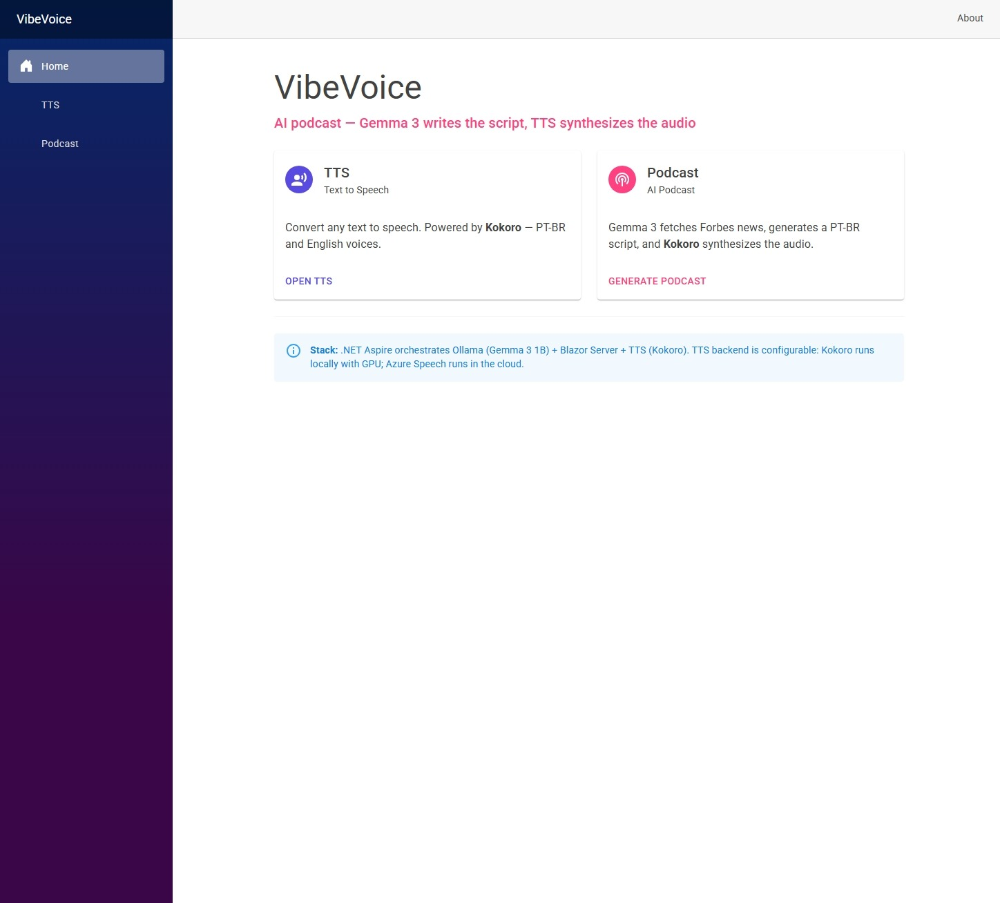
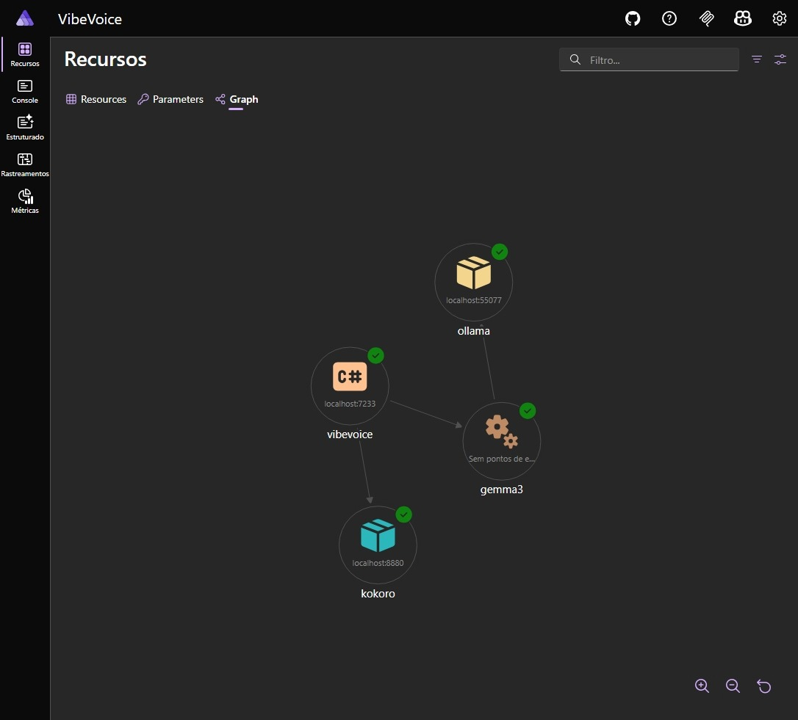
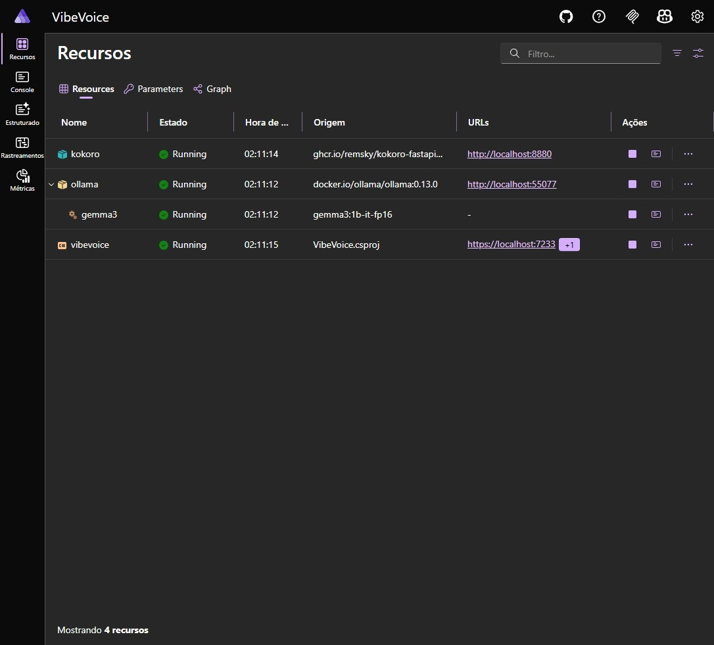
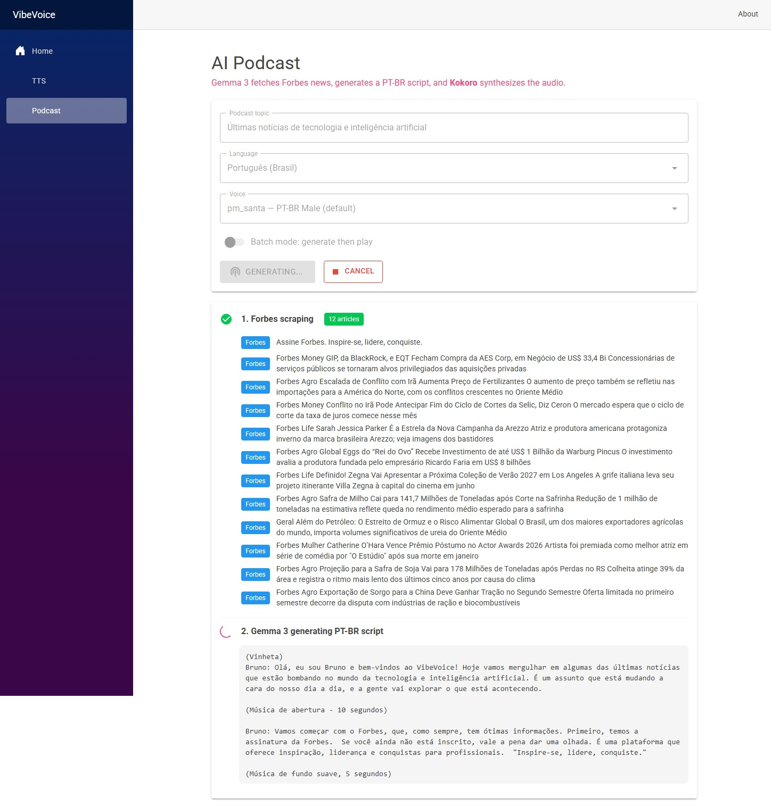

# VibeVoice

**AI podcast gratuito** — Gemma 3 gera o roteiro, TTS sintetiza o áudio. Projeto open-source para criar podcasts a partir de notícias do Forbes, com suporte a português brasileiro e inglês.



## Exemplo de áudio

Ouça um podcast gerado pelo VibeVoice (um locutor):

<audio controls>
  <source src="https://raw.githubusercontent.com/datasuricata/vibevoice/main/docs/exemplo-podcast.wav" type="audio/wav">
  Seu navegador não suporta o player. [Baixe o exemplo (WAV)](https://raw.githubusercontent.com/datasuricata/vibevoice/main/docs/exemplo-podcast.wav).
</audio>

**Exemplo com dois locutores** — diálogo entre dois hosts com vozes diferentes:

<audio controls>
  <source src="https://raw.githubusercontent.com/datasuricata/vibevoice/main/docs/exemplo-locutores-podcast.wav" type="audio/wav">
  Seu navegador não suporta o player. [Baixe o exemplo (WAV)](https://raw.githubusercontent.com/datasuricata/vibevoice/main/docs/exemplo-locutores-podcast.wav).
</audio>

## Funcionalidades

- **TTS (Text to Speech)** — Converte qualquer texto em áudio com vozes PT-BR e inglês
- **Podcast AI** — Busca notícias do Forbes, gera roteiro com Gemma 3 e sintetiza o áudio
- **Um ou dois locutores** — Modo solo (um host) ou diálogo (dois hosts interagindo com vozes diferentes)
- **Modo live** — Áudio começa a tocar enquanto o roteiro ainda está sendo gerado
- **Idiomas** — Selecione PT-BR ou English; as vozes disponíveis mudam conforme o idioma
- **TTS configurável** — Kokoro (local, GPU) ou Azure Speech (nuvem)

## Stack

| Componente | Tecnologia |
|------------|------------|
| Orquestração | .NET Aspire |
| Frontend | Blazor Server + MudBlazor |
| LLM | Ollama + Gemma 3 1B |
| TTS | Kokoro (local) ou Azure Speech (nuvem) |
| Fonte de notícias | Forbes Brasil |

## Arquitetura

O .NET Aspire orquestra todos os recursos. O grafo abaixo mostra a dependência entre os serviços:



- **vibevoice** — Aplicação Blazor (C#)
- **ollama** — Servidor de modelos LLM
- **gemma3** — Modelo Gemma 3 1B para geração de roteiros
- **kokoro** — Container TTS (quando o backend é Kokoro)

## Recursos em execução

O dashboard do Aspire exibe o estado de cada recurso:



## Geração de podcast

1. **Forbes scraping** — Carrega as últimas notícias
2. **Gemma 3** — Gera o roteiro em PT-BR ou inglês (solo ou diálogo entre dois locutores)
3. **TTS** — Sintetiza o áudio com a(s) voz(es) escolhida(s)



## Pré-requisitos

- [.NET 10 SDK](https://dotnet.microsoft.com/download)
- [Docker](https://www.docker.com/) (para Ollama e Kokoro)
- **GPU NVIDIA** — Necessária para o backend Kokoro (TTS local). O container Kokoro exige CUDA e drivers atualizados. Para Gemma 3 (Ollama), a GPU acelera a geração de roteiros. Se usar apenas Azure Speech como TTS, a GPU não é obrigatória.

## Configuração

### TTS Backend

No `appsettings.json` do **AppHost**, defina o backend de TTS:

```json
{
  "TtsBackend": "kokoro"
}
```

- **`kokoro`** — Container local com GPU (padrão). **Requer GPU NVIDIA** com drivers compatíveis (CUDA).
- **`azure`** — Azure Speech na nuvem. Não requer GPU.

### Azure Speech (opcional)

Se usar `TtsBackend: "azure"`, configure no `appsettings.json` do **VibeVoice**:

```json
{
  "AzureSpeech": {
    "Region": "eastus",
    "Key": "sua-chave-aqui"
  }
}
```

## Execução

```bash
cd src/VibeVoice.AppHost
dotnet run
```

O Aspire inicia o dashboard, Ollama, Gemma 3, Kokoro (se configurado) e a aplicação VibeVoice. Acesse:

- **VibeVoice** — https://localhost:7233 (ou porta exibida)
- **Aspire Dashboard** — URL exibida no console

## Estrutura do projeto

```
VibeVoice/
├── src/
│   ├── VibeVoice.AppHost/     # Orquestração Aspire
│   ├── VibeVoice/             # Blazor Server + serviços
│   └── VibeVoice.ServiceDefaults/
├── docs/                      # Screenshots e documentação
└── README.md
```

## Licença

MIT
